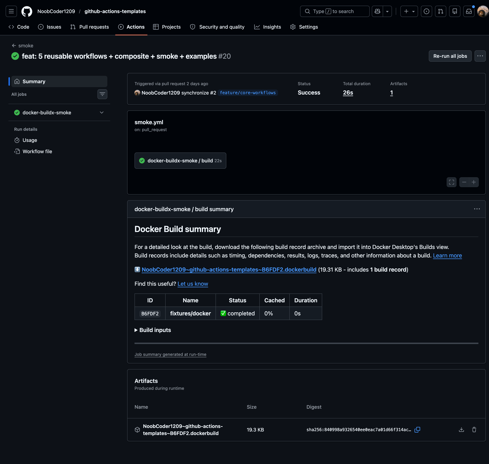
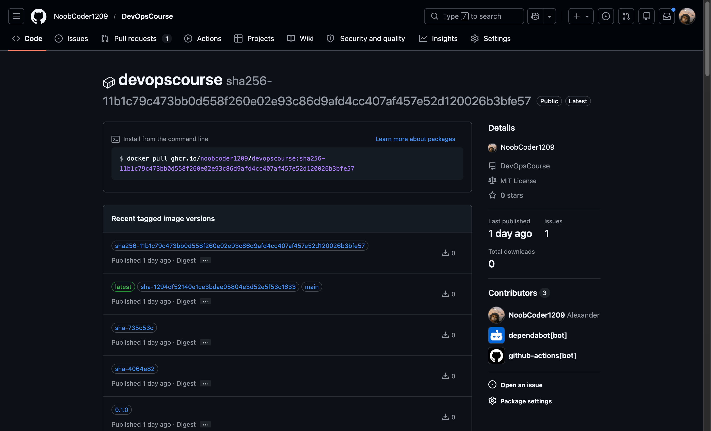

# github-actions-templates

> Reusable GitHub Actions workflows for the things every repo redoes — multi-arch container builds, semver releases, Helm OCI publishing, security scanning.

[](https://github.com/NoobCoder1209/github-actions-templates/actions/workflows/lint.yml)
[](https://github.com/NoobCoder1209/github-actions-templates/actions/workflows/smoke.yml)
[](LICENSE)

## Demo

In-repo `smoke` workflow self-calls `_docker-buildx` against a fixture Dockerfile on every PR — green = the most-used reusable in the library actually works end-to-end.



Real consumer (`NoobCoder1209/DevOpsCourse`) wires `_docker-buildx@v0.1.0` into its `build-and-push.yml` — the resulting GHCR image carries the auto-applied tags **and** a `sha256-...` SLSA build-provenance attestation referrer:



End-to-end walkthrough, every prerequisite, and the failure modes we hit while building this: see [`guide.md`](guide.md).

## Why

Every project ends up rebuilding the same five GitHub Actions workflows: a multi-arch container build, a release-on-tag, a Helm publish, an image vulnerability scan, a dependency scan. This repo packages those as `workflow_call` reusables so consumers can drop a 15-line caller into `.github/workflows/` and be done.

## Catalogue

| Workflow | Purpose | Required inputs | Required secrets | When to use |
|---|---|---|---|---|
| [`_docker-buildx.yml`](.github/workflows/_docker-buildx.yml) | Multi-arch Docker build, GHCR push, SLSA provenance + SBOM, keyless build attestation | `image` | none for GHCR | Any repo that ships a container image |
| [`_semver-release.yml`](.github/workflows/_semver-release.yml) | On `v*.*.*` tag push: Conventional-Commits changelog + GitHub Release with assets | _(none required)_ | none | Library / CLI / binary releases |
| [`_helm-oci-push.yml`](.github/workflows/_helm-oci-push.yml) | `helm package` + `helm push` to OCI registry (default GHCR) | _(none required)_ | none for GHCR | Helm chart maintainers |
| [`_trivy-scan.yml`](.github/workflows/_trivy-scan.yml) | Image scan, SARIF upload (always), gating fail at `CRITICAL,HIGH,MEDIUM` | `image` | none | Any repo that builds an image |
| [`_snyk-deps.yml`](.github/workflows/_snyk-deps.yml) | Snyk dependency scan for `node|python|go` at threshold `medium` | `language` | `snyk_token` | Repos with `package.json`, `requirements*.txt`, or `go.mod` |

Plus a composite action [`setup-tools`](.github/actions/setup-tools/) that installs `helm`, `kubectl`, `kind`, `terraform`, `tflint`, `helm-docs` into the calling job's `PATH`.

## Skills demonstrated

GitHub Actions · CI/CD · DevOps · Docker (multi-arch buildx) · Helm (OCI) · Security scanning (Trivy, Snyk, SARIF) · SLSA provenance / supply-chain · Conventional Commits releases.

## Quick start

Drop this into `.github/workflows/build.yml` of any repo with a `Dockerfile` — multi-arch image, pushed to GHCR, with SLSA build provenance.

```yaml
name: build
on:
  push:
    branches: [main]
    tags: ['v*.*.*']
  pull_request:
    branches: [main]

jobs:
  image:
    permissions:
      contents: read
      packages: write
      id-token: write
      attestations: write
    uses: NoobCoder1209/github-actions-templates/.github/workflows/_docker-buildx.yml@v0.1.0
    with:
      image: ${{ github.repository }}
      platforms: linux/amd64,linux/arm64
      push: ${{ github.event_name != 'pull_request' }}
```

Five copy-pasteable consumer workflows live under [`examples/`](examples/) — one per reusable.

## Versioning

Pin every `uses:` to a tag. Never `@main`.

```yaml
# good
uses: NoobCoder1209/github-actions-templates/.github/workflows/_docker-buildx.yml@v0.1.0

# bad — surprise breakage when the library moves on
uses: NoobCoder1209/github-actions-templates/.github/workflows/_docker-buildx.yml@main
```

Releases follow `vMAJOR.MINOR.PATCH` semver and ship a Conventional-Commits changelog generated by `_semver-release.yml` itself (this repo dogfoods).

## Caller-side permissions

Reusable workflows can only RECEIVE permissions the caller already holds — GHA enforces this statically at pre-flight, not at runtime. Even if you pass `push: false`, the calling job must grant the same elevated permissions the callee declares.

| Reusable | Calling job must grant |
|---|---|
| `_docker-buildx.yml` | `contents: read`, `packages: write`, `id-token: write`, `attestations: write` |
| `_semver-release.yml` | `contents: write` |
| `_helm-oci-push.yml` | `contents: read`, `packages: write` |
| `_trivy-scan.yml` | `contents: read`, `security-events: write`, `packages: read` |
| `_snyk-deps.yml` | `contents: read`, `security-events: write`, `actions: read` |

The example consumers under [`examples/`](examples/) all declare these correctly.

## Workflow templates UI

The `workflow-templates/starter.yml` shows up in your org's "New workflow" picker once this repo is public, giving any teammate a one-click way to wire up multi-arch builds.

## License

[MIT](LICENSE)
